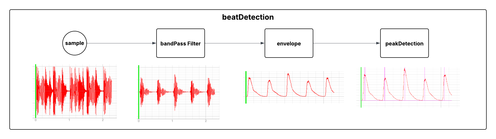

# JellED
The Jellyfish with LED support.
Live beat detection and lightshow.

This project consists of the following parts

* beatDetection library
* patternEngine library
* soundalyzer

## beatDetection library
Provides a real-time filter chain for beat detection on a sampled music signal.



## soundalyzer
A python playground for all music analysing and beat detection that allows to visualize and validate filters and musical signals.
It build on `scipy`, `numpy` and `wave` for _.wav_ analysis.
Generate test files for the cpp filter chain with:

```
$ python soundalyzer.py --mode GEN_TEST_EXPECTATIONS
```

## Dependencies

* [AudioFile by adamstark](https://github.com/adamstark/AudioFile)
