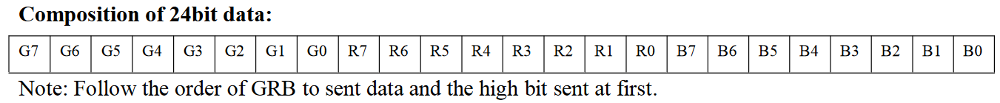
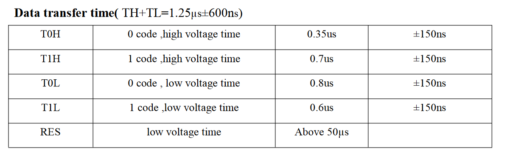

# Interfacing with the WS2812
For transmitting data from the ESP32 to the WS2812, the ESP32's Remote Control Transceiver (RMT) peripheral is used. More specifically, the [Arduino Library](https://docs.espressif.com/projects/arduino-esp32/en/latest/api/rmt.html) for the ESM32 TMP. This is encapsulated in the `WS2812` class in the `led` lib. Here, the internals of the `WS2812` class are described.

## Initialization
A new `WS2812` instance is created via the construtor:

```
WS2812(uint8_t output_pin, uint16_t led_count);
```

This specifies the GPIO output pin on the ESP32 and sets the number of LEDs that should be controlled on the strip. The actual initialization happens within `initialize()`.

```
if ((rmt_send = rmtInit(pin, RMT_TX_MODE, RMT_MEM_64)) == NULL){
		return false;
}
```

This initializes the RMT peripheral by specifying the GPIO output pin, setting it in trasmitting mode, and reserving one buffer of memory. Internally, the Arduino library treats `RMT_MEM_64` as one channel buffer.

Afterwards, all LEDs in the WS2812 are set to 0 i.e. off and the tick rate is set to 100 nanoseconds. This wlil become important when transmitting the data later.

```
rmtSetTick(rmt_send, 100);
```

# Address the LEDs
Letting the LEDs show colors is implemented in a two way approach. First, the color values for each LED on the strip is specified via `setColorChannelsFor(int, uint8_t, uint8_t, uint8_t)`. Second, in order to actually transmit the data, `show()` needs to be called.

## Setting Data
A look into the [WS2812 datasheet](https://cdn-shop.adafruit.com/datasheets/WS2812.pdf) reveals that it expects data in a GRB format:



Therefore, the order is mixed up a little in following line

```
setPixel(index, g, r, b);
```

In `setPixel()` the actual magic happens. The WS2812 expects data in a time encoded manner that can be taken from the datasheet:



This means that in order to transmit a `0`, the voltage needs be be low for 0.35us and high for 0.8us. To transmit a `1`, the voltage on the GPIO needs to be high for 0.7us and low for 0.6us. Because we defined the tick rate to tick at every 100 nanoseconds, the WS2812 protocol nicely translates into RMT code. For example for sending a zero, we use the following method:

```
void WS2812::writeZero(int index, uint8_t bit) {
	const uint8_t bit_index = index * bit_resolution + bit; 
	led_data[bit_index].level0 = 1;
	led_data[bit_index].duration0 = 4;
	led_data[bit_index].level1 = 0;
	led_data[bit_index].duration1 = 8;
}
```

In RMT, this translates to:
1. Set GPIO to 1 (high) for 4 ticks i.e. 400 ns (=0.4us) and set to 0 (low) for 8 ticks i.e. 800 nanosecnods (0.8us)

## Transmitting Data
After each individual LED's color was specified and is stored in memory, it can be transmitted to the `WS2812` all at once with a call to `show()`.

